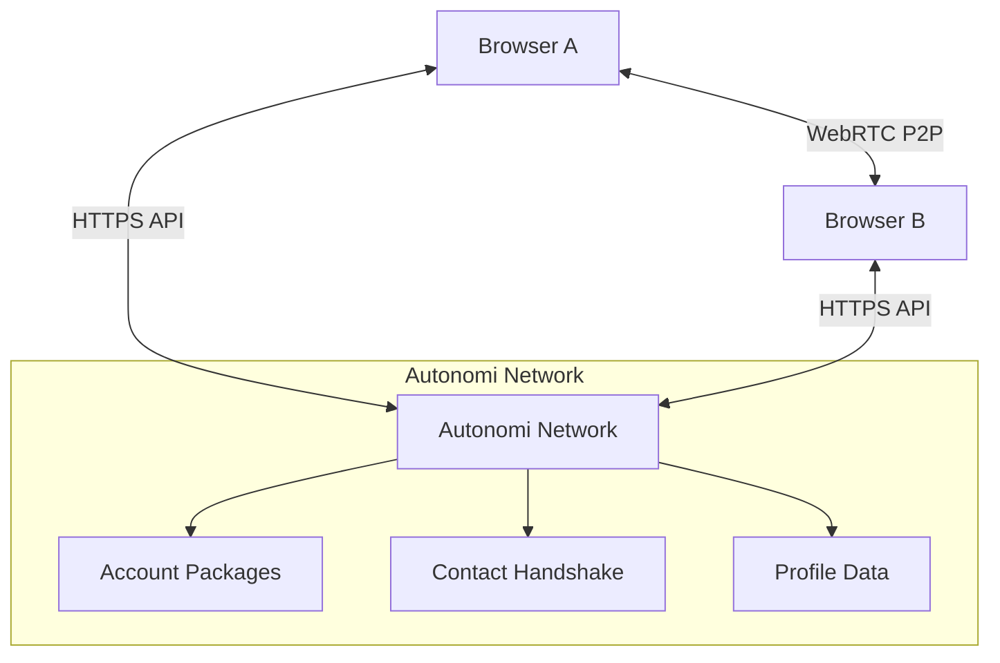

# P2P Chat Application

A decentralized peer-to-peer chat application that enables secure, private communication between friends using WebRTC for direct browser-to-browser communication and the Autonomi Network for contact establishment.

## Features

- **Direct P2P Communication**: WebRTC-based peer-to-peer messaging between browsers
- **Autonomi Network Integration**: Uses Autonomi Network scratchpads for contact handshake and account management
- **Account Packages**: Store user profiles (username, avatar) on the Autonomi Network
- **Dark/Light Mode**: User-friendly interface with theme support
- **File Sharing**: Support for sending files and images directly between peers
- **Desktop Notifications**: Get notified of new messages when the tab is in the background
- **Connection Monitoring**: Native WebRTC connection state monitoring for reliable communication

## Architecture

The application uses a hybrid approach combining WebRTC and the Autonomi Network:



- **WebRTC**: Direct browser-to-browser communication for real-time messaging and file transfer
- **Autonomi Network**: Decentralized storage for account packages and contact establishment
- **Scratchpads**: Used for storing user profiles and facilitating initial contact between peers


## Account Package Format

Account packages are stored in the Autonomi Network using the scratchpad format:

```json
{
  "username": "your-username",
  "profileImage": "datamap-address-for-avatar"
}
```


## License

MIT License - see [LICENSE](LICENSE) file for details.
