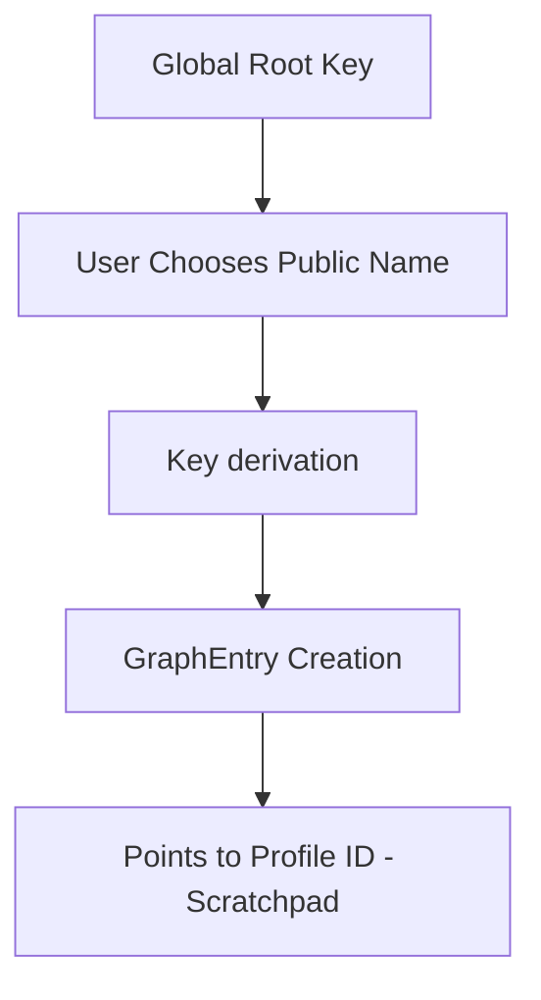
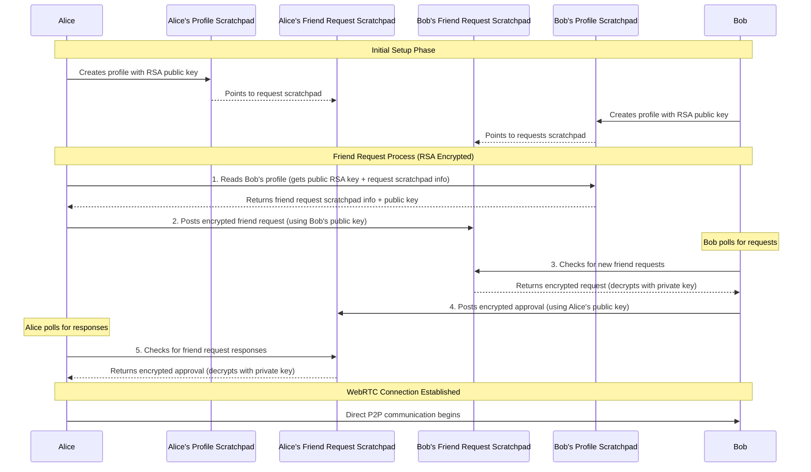
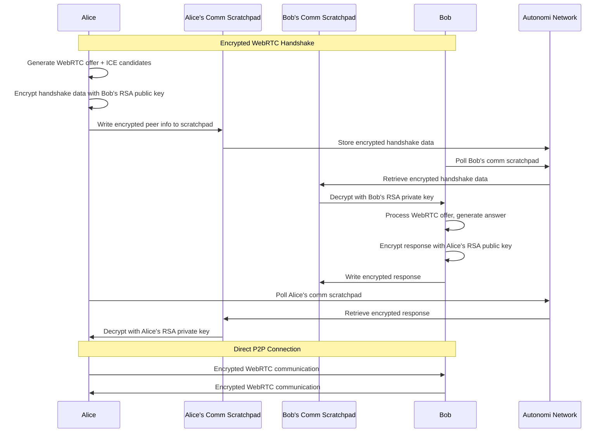
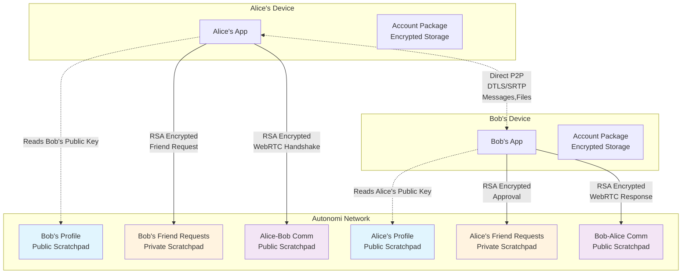

# The Friends Messenger

A unique completely decentralized messenger that doesn't use any centralised servers to establish a direct p2p communication between friends.

## Features

The Friends Chat Application enables direct peer-to-peer communication between users via WebRTC with advanced cryptographic security.
The Handshake to exchange Peer Info doesn't rely on a classic Server but utilizes the [Autonomi Network](https://www.autonomi.com) as handshake server (to be more precise Scratchpads on the autonomi network) for this. All handshake data and friend requests are protected with RSA encryption, ensuring that only the intended recipients can access the peer information needed for establishing connections.

To sign up, create an account and start chatting with a friend you can see the flow in this little demo:
(shows just inline and playable on [the main repo on codeberg](https://codeberg.org/riddim/friends) - github users who don't want to leave the platform need to follow the link and click on "view raw")


### planned Features:

- easier theming
- plugins (through JS Webcomponents loaded from immutable chunks on Autonomi)
- multi-user chat
- optionally persisting chat history
- sending offline messages => encrypted to a friend-specific scratchpad
- more extensive profile pages
- better status (more options even when online)
- App as JS Webcomponent (usable by other Autonomi Apps)
- App as Native App for all OSes and mobile

## Security Aspects

The Friends Messenger ensures secure communication through multiple layers of encryption and cryptographic security:

- **RSA-Encrypted Handshake**: All WebRTC handshake data (peer information, ICE candidates, SDP offers/answers) are encrypted using RSA-OAEP hybrid encryption before being stored on Autonomi scratchpads
- **Account-Level RSA Keys**: Each user account contains a 2048-bit RSA key pair - the private key is stored encrypted in the user's account package, while the public key is published in their profile for others to use
- **Hybrid Encryption**: Friend requests and handshake data use AES-256-CBC encryption with RSA-encrypted AES keys, ensuring both security and performance for larger data payloads
- **End-to-End Encryption**: All direct peer-to-peer communication is secured via WebRTC's built-in DTLS (Datagram Transport Layer Security) and SRTP (Secure Real-time Transport Protocol)
- **Cryptographic Identity**: Each user has a unique cryptographic profile ID (96-character hex string) derived from their account creation process
- **Decentralized Handshake**: No central server stores or has access to user data - the Autonomi Network facilitates the initial peer discovery with all handshake data encrypted
- **Perfect Forward Secrecy**: Each WebRTC session establishes new encryption keys, ensuring past communications remain secure even if keys are compromised
- **No Data Persistence**: Messages are not stored on any server - they exist only during the active peer-to-peer session

## Installation & Start

To start the P2P chat application, you first need to install the `dweb` command line tool (after installing rustup if you don't have that; description and link in the troubleshooting section at the bottom):

```bash
cargo install --locked dweb-cli
```

and then you need to make sure to include a private key holding some Eth(Arb) and ANT in your environment variables to enable dweb to pay for the needed Account Setup (one digit USD worth of Eth and 1 ANT are enough for everything needed as of now)

easiest is to include this export in your ~/.bashrc (or other terminal init file)
> export SECRET_KEY=0x1111111111111111111111111111111111111111111111111111111111111111

After installation, you can start the dweb server with:
(blocks one terminal session)

```bash
dweb serve
```

and then you can open friends from a 2nd terminal with

```bash
dweb open friends
```

For more detailed instructions regarding dweb, please visit the [dweb repository](https://codeberg.org/happybeing/dweb).

## Technical Details:

### Unique Public Identifier



The Friends Messenger uses a sophisticated cryptographic identity system:

1. **Profile ID Generation**: When a user creates an account, a unique 96-character hexadecimal Profile ID is generated and used as their cryptographic identity
2. **Public Scratchpad**: This Profile ID becomes the address of a public scratchpad on the Autonomi Network containing the user's profile information (display name, profile image, friend request details)
3. **Public Identifier (Optional)**: Users can create human-readable public names (like usernames) that point to their Profile ID via cryptographic pointers
4. **Searchable Identity**: Friends can find each other either by the full 96-character Profile ID or by the optional public identifier

### Friendship Requests



### WebRTC Handshake with RSA Encryption




The friendship system works through a RSA-encrypted scratchpad-based messaging system where all sensitive communication data is protected from unauthorized access:

1. **Profile Discovery**: Each user's profile is stored in a public scratchpad at their Profile ID address, containing their display name, profile image, RSA public key, and access credentials for their friend request scratchpad

2. **RSA Key Infrastructure**: Each account contains a 2048-bit RSA key pair:
   - **Private Key**: Stored encrypted in the user's private account package on Autonomi Network
   - **Public Key**: Published in the user's public profile for others to encrypt data sent to them

3. **Encrypted Friend Request Scratchpad**: Each user has a scratchpad for receiving friend requests where:
   - Incoming friend requests are encrypted using the recipient's RSA public key
   - Only the recipient can decrypt them using their private key
   - This prevents unauthorized users from reading friend request data

4. **Request Process**: When Alice wants to add Bob as a friend:
   - Alice looks up Bob's Profile ID (either full 96-char ID or via public identifier)
   - Alice reads Bob's public profile to get his RSA public key and friend request scratchpad details
   - Alice encrypts her friend request using Bob's public key before posting it to his friend request scratchpad

5. **Response Process**: Bob periodically checks his friend request scratchpad:
   - Bob retrieves encrypted friend requests and decrypts them with his private key
   - If approved, Bob encrypts his response using Alice's public key and posts it to Alice's response scratchpad
   - Alice polls her response scratchpad and decrypts Bob's approval with her private key

6. **WebRTC Handshake Encryption**: During connection establishment:
   - All WebRTC handshake data (offers, answers, ICE candidates) are encrypted using the friend's RSA public key
   - Handshake data is transmitted via communication scratchpads on the Autonomi Network
   - Only the intended recipient can decrypt and process the handshake information

7. **Connection Establishment**: Once both parties have exchanged encrypted handshake data, they establish a direct WebRTC connection for real-time communication

This decentralized approach ensures no central server ever sees or stores the friend relationships - everything is mediated through the Autonomi Network's scratchpad system with strong RSA encryption protecting all sensitive data.

### RSA Encryption Implementation

The Friends Messenger implements a robust hybrid encryption system that combines the security of RSA with the performance of AES:

#### Key Generation and Storage
- **Account Creation**: Each new account automatically generates a 2048-bit RSA key pair using RSA-OAEP with SHA-256
- **Private Key Storage**: The private key is stored in PEM format within the user's encrypted account package on the Autonomi Network
- **Public Key Publishing**: The public key is automatically published in the user's public profile, making it accessible to friends for encryption

#### Hybrid Encryption Process
When encrypting data (friend requests, WebRTC handshake data):

1. **AES Key Generation**: A random 256-bit AES key and 128-bit initialization vector (IV) are generated
2. **Data Encryption**: The actual payload is encrypted using AES-256-CBC with the generated key
3. **Key Encryption**: The AES key is encrypted using the recipient's RSA public key (RSA-OAEP)
4. **Container Creation**: An encrypted container is created containing:
   - `encryptedKey`: RSA-encrypted AES key (base64 encoded)
   - `encryptedData`: AES-encrypted payload (base64 encoded)  
   - `iv`: Initialization vector (base64 encoded)

#### Decryption Process
When receiving encrypted data:

1. **Key Extraction**: The RSA-encrypted AES key is extracted from the container
2. **Key Decryption**: The AES key is decrypted using the recipient's RSA private key
3. **Data Decryption**: The payload is decrypted using AES-256-CBC with the decrypted key and IV
4. **Payload Processing**: The decrypted data is processed according to its type (friend request, handshake data, etc.)

This approach ensures that:
- Large data payloads benefit from fast AES encryption
- Strong RSA security protects the AES keys
- Only the intended recipient can decrypt the data
- Performance remains optimal even with larger WebRTC handshake data

### Architecture & Technologies

The Friends Messenger is built using modern web technologies with a focus on cryptographic security:

- **Frontend**: Svelte/SvelteKit for reactive user interface
- **WebRTC**: Direct peer-to-peer communication with automatic NAT traversal
- **Autonomi Network**: Decentralized storage network for profile and friend request data
- **Scratchpads**: Autonomi's mutable storage system for user profiles and to facilitate peer discovery
- **Smokesigns Library**: WebRTC abstraction layer for simplified peer connections with integrated RSA encryption support
- **RSA Cryptography**: 2048-bit RSA-OAEP keys for encrypting handshake data and friend requests
- **Hybrid Encryption**: AES-256-CBC for data encryption with RSA-encrypted AES keys for optimal performance
- **Cryptographic Security**: SHA256 hashing and hex-based addressing for secure identity management

### Data Flow and Encryption Channels



**Data Channel Security:**
- **Blue (Profile Scratchpads)**: Public readable, contains RSA public keys and profile info
- **Orange (Friend Request Scratchpads)**: RSA-encrypted friend requests and approvals
- **Purple (Communication Scratchpads)**: RSA-encrypted WebRTC handshake data
- **Direct P2P**: End-to-end encrypted via WebRTC's DTLS/SRTP protocols

## Troubleshooting

I recommend installing dweb via cargo after installing [rustup](https://www.rust-lang.org/learn/get-started) (the rust development environment)

e.g. on Linux/MacOS:

`curl --proto '=https' --tlsv1.2 -sSf https://sh.rustup.rs | sh`

(after that you need to close and open the terminal again)

then the

```bash
cargo install --locked dweb-cli
```

### Error scenarios

in case you see errors with the dweb install you may need to:

```bash
sudo apt-get update && sudo apt-get install libssl-dev pkg-config
```

## Local Development

To set up a local development environment for the Friends Messenger, follow these steps:

1. Clone the repository
   ```bash
   git clone https://codeberg.org/riddim/friends.git
   ```
2. Install dependencies:
   ```bash
   npm install
   ```
3. Start the development server:
   ```bash
   npm run dev
   ```
   
This will launch the application in development mode with hot-reloading enabled.

### Optional URL Parameters

The development version supports several URL parameters to customize the application behavior:

- **accountname**: use a derived account for development (the name doesn't need to be the display name - it's just used for key derivation to be able to use multiple accounts with the same SECRET_KEY)
  ```
  http://localhost:5173/?accountname=testuser
  ```

- **backend**: Specifies a custom local dweb server as Autonomi backend (so data fetch calls will not be sent to the dev server but to the dweb backend which enables network interaction up/download of data to the Autonomi alpha test network / the Autonomi mainnet during App development)
  ```
  http://localhost:5173/?backend=http://localhost:5537
  ```

- **debug**: sets the debug flag to True => the App shows additional debug info like Scratchpad addresses. Particularly useful when wanting to have extended info available while not flooding the UI for the regular user. (But for debugging purposes users with trouble could set the query param and help with debugging without a lot of hassle too)
  ```
  http://localhost:5173/?debug=true
  ```

You can combine multiple parameters:
```
http://localhost:5173/?accountname=testuser&backend=http://localhost:5537&debug=true
```

These parameters are particularly useful for testing code changes without uploading the app to the Autonomi network repeatedly.

### App optimization for Autonomi

The Friends Messenger is specifically optimized for deployment on the Autonomi Network. The application structure minimizes the number of generated files during compilation, resulting in faster loading times and more cost-efficient operation on the decentralized network.

#### Static Adapter & Client-Side Architecture

The app uses `@sveltejs/adapter-static` to generate a pure client-side application with no server-side dependencies. This is crucial for deployment on the Autonomi Network, as it allows the app to run entirely in the user's browser without any backend server requirements beyond the Autonomi Network itself.

#### Configuration Optimizations

Key optimizations in `svelte.config.js` include:

```javascript
// Disable version.json polling
version: {
    pollInterval: 0
},

// Disable environment variables embedding in env.js
env: {
    publicPrefix: 'UNUSED_'
},

// Bundle strategy for optimized output
output: {
    bundleStrategy: 'single'
}
```

#### Custom Vite Plugin for File Removal

Despite the SvelteKit configuration, certain files like `env.js` and `version.json` are still generated during the build process. To ensure these are not included in the final bundle, a custom Vite plugin in `vite.config.ts` removes them:

```typescript
// Plugin that removes env.js / version.json from the build
function stripSvelteKitMeta(): Plugin {
  return {
    name: 'strip-sveltekit-meta',
    generateBundle(_options, bundle) {
      // Remove all bundle entries ending with env.js or version.json
      for (const key of Object.keys(bundle)) {
        if (key.endsWith('env.js') || key.endsWith('version.json')) {
          delete (bundle as any)[key];
        }
      }

      // Remove import references to env.js in all chunks
      for (const [, chunk] of Object.entries(bundle)) {
        if (chunk.type === 'chunk') {
          const c = chunk as unknown as { code: string };
          c.code = c.code.replace(/import[^\n]*['\"]\.\/env\.js['\"];?\n?/g, '');
        }
      }
    },
    // Also physically delete the files from the output directory
    async closeBundle() { /* file deletion code */ }
  };
}
```

This approach ensures that the application loads quickly from the Autonomi Network while minimizing the cost of deployment and updates.