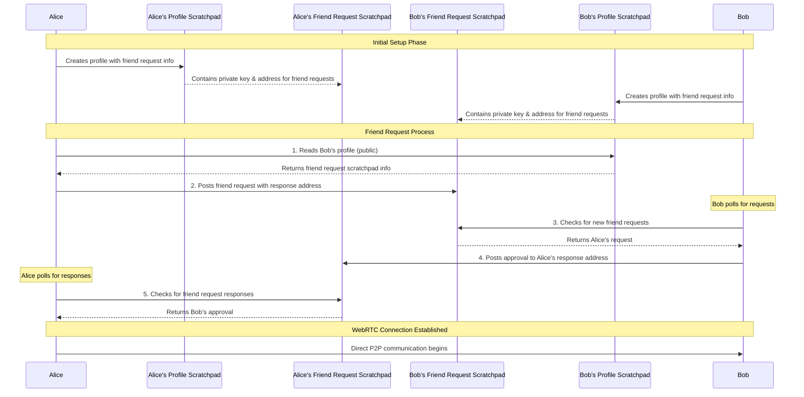

# The Friends Messenger

A unique completely decentralized messenger that doesn't use any centralised servers to establish a direct p2p communication between friends.

## Features

The Friends Chat Application enables direct peer-to-peer communication between users via WebRTC.
The Handshake to exchange Peer Info doesn't rely on a classic Server but utilizes the [Autonomi Network](https://www.autonomi.com) as handshake server (to be more precise Scratchpads on the autonomi network) for this.

To sign up, create an account and start chatting with a friend you can see the flow in this little demo:


## Security Aspects

The Friends Messenger ensures secure communication through multiple layers:

- **End-to-End Encryption**: All peer-to-peer communication is secured via WebRTC's built-in DTLS (Datagram Transport Layer Security) and SRTP (Secure Real-time Transport Protocol)
- **Cryptographic Identity**: Each user has a unique cryptographic profile ID (96-character hex string) derived from their account creation process
- **Decentralized Handshake**: No central server stores or has access to user data - the Autonomi Network only facilitates the initial peer discovery
- **Perfect Forward Secrecy**: Each WebRTC session establishes new encryption keys, ensuring past communications remain secure even if keys are compromised
- **No Data Persistence**: Messages are not stored on any server - they exist only during the active peer-to-peer session

## Installation & Start

To start the P2P chat application, you first need to install the `dweb` command line tool:

```bash
cargo install --locked dweb-cli
```

For detailed installation instructions, please visit the [dweb repository](https://codeberg.org/happybeing/dweb).

After installation, you can start the application with:

```bash
dweb open friends
```


## Technical Details:

### Unique Public Identifier

```mermaid
graph TD
    A[Global Root Key] --> B[User Chooses Public Name]
    B --> H[Key derivation]
    H --> I[GraphEntry Creation]
    I --> J[Points to Profile ID (Scratchpad)]
```

The Friends Messenger uses a sophisticated cryptographic identity system:

1. **Profile ID Generation**: When a user creates an account, a unique 96-character hexadecimal Profile ID is generated and used as their cryptographic identity
2. **Public Scratchpad**: This Profile ID becomes the address of a public scratchpad on the Autonomi Network containing the user's profile information (display name, profile image, friend request details)
3. **Public Identifier (Optional)**: Users can create human-readable public names (like usernames) that point to their Profile ID via cryptographic pointers
4. **Searchable Identity**: Friends can find each other either by the full 96-character Profile ID or by the optional public identifier

### Friendship Requests




The friendship system works through a simple scratchpad-based messaging system where the communication partners tell each other where they expect the messages and check that location in intervals:

1. **Profile Discovery**: Each user's profile is stored in a public scratchpad at their Profile ID address, containing their display name, profile image, and most importantly, the access credentials for their friend request scratchpad

2. **Friend Request Scratchpad**: Each user has a private scratchpad where friend requests are received. The profile contains the private key needed to write to this scratchpad. Since the private key to this Friend Request Scratchpad this will be changeable in future upgrades => to mess it up repeatedly would be costly because then the requester would need to pay for it.

3. **Request Process**: When Alice wants to add Bob as a friend:
   - Alice looks up Bob's Profile ID (either full 96-char ID or via public identifier)
   - Alice reads Bob's public profile to get his friend request scratchpad details
   - Alice posts a friend request containing her own response scratchpad address

4. **Response Process**: Bob periodically checks his friend request scratchpad:
   - When Bob sees Alice's request, he can choose to approve or deny
   - If approved, Bob posts his response to Alice's specified response address
   - Alice polls her response scratchpad and receives Bob's approval

5. **Connection Establishment**: Once both parties have exchanged scratchpad addresses, they can establish a direct WebRTC connection for real-time communication

This decentralized approach ensures no central server ever sees or stores the friend relationships - everything is mediated through the Autonomi Network's scratchpad system.

### Architecture & Technologies

The Friends Messenger is built using modern web technologies:

- **Frontend**: Svelte/SvelteKit for reactive user interface
- **WebRTC**: Direct peer-to-peer communication with automatic NAT traversal
- **Autonomi Network**: Decentralized storage network for profile and friend request data
- **Scratchpads**: Autonomi's mutable storage system for user profiles and to facilitate peer discovery
- **Smokesigns Library**: WebRTC abstraction layer for simplified peer connections
- **Cryptographic Security**: SHA256 hashing and hex-based addressing for secure identity management

### Development Features

- **Multi-language Support**: UI available in English and German. Other languages will follow soonish
- **File Sharing**: Support for sending images, videos, and files through WebRTC data channels
- **Theme Support**: Customizable UI themes
- **Real-time Status**: Connection status indicators 