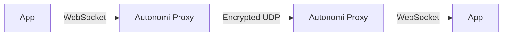

# P2P Chat Application

A decentralized peer-to-peer chat application that enables secure, private communication between friends without relying on centralized servers.

## Features

- **P2P Communication**: Direct peer-to-peer messaging between friends
- **Automatic Translation**: Built-in translation powered by Ollama (requires a local Ollama server on at least one side)
- **Dark/Light Mode**: User-friendly interface 2 themes
- **File Sharing**: Support for sending files and images (currently a bit unstable)

## Architecture

The application uses a hybrid approach for communication:



- **WebSocket Connection**: Connects the app to the Autonomi proxy
- **UDP Communication**: Encrypted content exchange between proxies
- **Future**: Peer information exchange via Autonomi network

## Roadmap

### Short-term Goals
- **Multi-user Chats**: Support for group conversations
- **Direct Messages within Multi-user Chats**: Private communication within multi-user chats using public/private key encryption
- **Improved File Sharing**: Enhanced reliability and bug fixes

### Long-term Vision
- **Voice Chat**: Real-time audio communication
- **Video Chat**: Video conferencing capabilities
- **Library Development**: Core functionality packaged as a reusable library for other applications

### Extended Applications
The core technology can be adapted for various use cases:
- Status information sharing ("online", "contact sharing")
- Collaborative document editing without permanent write operations
- Real-time inventory management ("item reserved in another shopping cart")
- Location sharing and tracking

## Getting Started

### For Developers
```bash
npm install
npm run dev
```

## License

MIT License

Copyright (c) 2025

Permission is hereby granted, free of charge, to any person obtaining a copy
of this software and associated documentation files (the "Software"), to deal
in the Software without restriction, including without limitation the rights
to use, copy, modify, merge, publish, distribute, sublicense, and/or sell
copies of the Software, and to permit persons to whom the Software is
furnished to do so, subject to the following conditions:

The above copyright notice and this permission notice shall be included in all
copies or substantial portions of the Software.

THE SOFTWARE IS PROVIDED "AS IS", WITHOUT WARRANTY OF ANY KIND, EXPRESS OR
IMPLIED, INCLUDING BUT NOT LIMITED TO THE WARRANTIES OF MERCHANTABILITY,
FITNESS FOR A PARTICULAR PURPOSE AND NONINFRINGEMENT. IN NO EVENT SHALL THE
AUTHORS OR COPYRIGHT HOLDERS BE LIABLE FOR ANY CLAIM, DAMAGES OR OTHER
LIABILITY, WHETHER IN AN ACTION OF CONTRACT, TORT OR OTHERWISE, ARISING FROM,
OUT OF OR IN CONNECTION WITH THE SOFTWARE OR THE USE OR OTHER DEALINGS IN THE
SOFTWARE.
